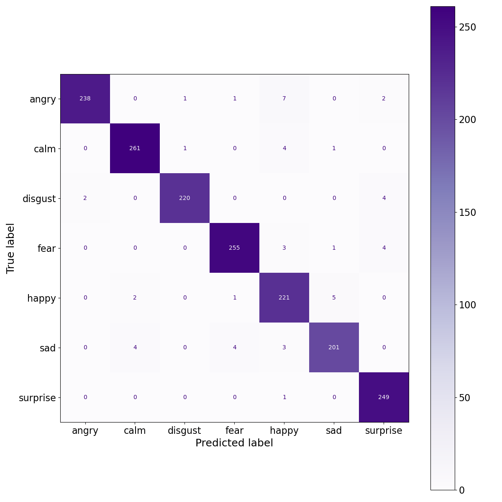

<h1 align="center"><b>Real Time Speech Emotion Recognition</b></h1>

#### Trained and developed the multiclass classification model, which detects seven types of emotions which, includes Calm, Happy, Angry, Sad, Fearful, and Disgust, from human speech with the gender classification module using Long-Short Term Memory Neural Network with hyperparameter tuning by giving the input features Root Mean Squared Energy, MFCCs, Mel-Spectrogram with achieving the categorical training accuracy of 0.9906 with a loss of 0.035 and the validation accuracy of 0.9684 with a loss of 0.1184.

## Overview
- In this project I have used 2 different datasets which are the RAVDESS and the TESS dataset.
- Used 8480 total number of audio samples to train the model.
- Build the neural network with the RElU Activation function for hidden layers
- Used Softmax Activation function for output layer
- Define the batch size of 256 with Epoch 160
- Achived Train-Test Accuracy of 99-96 %

## Working of Real Time Detection 
- For real time detection it continuously listen for the audio using microphone and evey 2.6 seconds it perform detection on that clip of audio and at the end of the session it gives you the session summary of the emotions.

## How to run
- To train the model use Feature_Extraction_and_Model_Traning.ipynb Jupyter Notebook File
- To start real time detection use Real_Time_Emotion_Detector.ipynb Jupyter Notebook File

## Screenshots

### Neural Network Architecher

### Performance Graph
#### Accuracy Graph

#### Loss Graph

### Confusion Matrix

### Main Interface

### Session Summary

<h1 align="center"><b>Real Time Speech Emotion Recognition With Gender Classification</b></h1>

### I have also trained the model with Male-Female Classification with 7 different emotions with total 14 labels. Everything remain same as discribed above except the output labels.
## Screenshots

### Neural Network Architecher

### Performance Graph
#### Accuracy Graph

#### Loss Graph

### Confusion Matrix

### Main Interface

